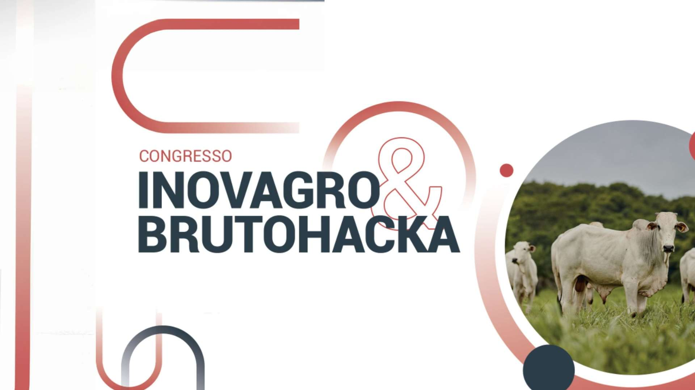
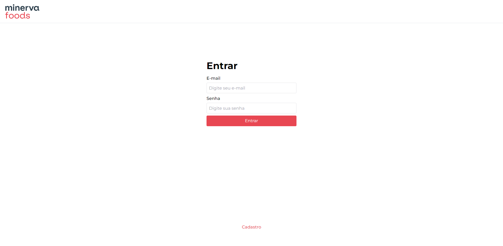

# Minerva Feedbacks

### Projeto desenvolvido durante o evento Congresso InovaAgro e BrutoHacka realizado nos dias 01, 02 e 03 de Abril de 2023.

  

 

## Problemas impostos BrutoHacka 2023 (Escolher 1 ou mais desafios)

#### 1 - Desenvolver uma solução que consiste em contabilizar os bois que passam por um corredor, não podendo contar um boi mais de 1 vez. 🐮

#### 2 - Desenvolver uma solução que consiste em detectar numa esteira com uma máquina de embalagem, onde passam bandejas de carne. Se elas estão fechadas, a máquina deve embalar, porém se a bandeja estiver aberta, a máquina não deve embalar. 📦

#### 3 - Desenvolver uma solução que consiste em uma plataforma de feedbacks, onde os colaboradores deixam suas sugestões, ideias e reclamações e os administradores podem responder as sugestões enviadas em sua unidade. 🙍‍♂️

 

## Desafio resolvido: N° 2 📦

#### O desafio foi solucionado com um front-end usando NextJS 14 e TailwindCSS. O back-end, consiste em uma API REST usando Go, PostgreSQL e Docker.

  

### [Ver projeto](https://minervafeedback.vercel.app)
